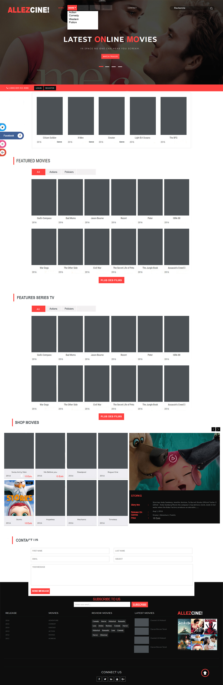

# frontend-AllezCine
Ce repo contient le produit du travail d'une merveilleuse team :
- David Bouzouita : 
- Mathieu Debras : 
- Maxime Christiaens : 
- Thomas Bailleux : 

## But du travail 
Nous devions reproduire un layout ainsi que créer une newsletter

# Notre Layout 

# Notre Newsletter

## Le layout à reproduire

